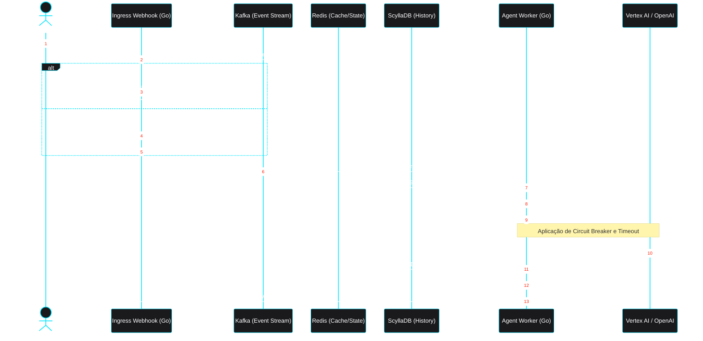

# Motor de Roteamento e Orquestração Headless

Este fluxo detalha o ciclo de vida de uma mensagem recebida via WhatsApp. O foco arquitetural é o isolamento de falhas: o webhook responde à Meta em milissegundos, enquanto os *workers* em Go processam a máquina de estados e a inteligência artificial de forma assíncrona.

