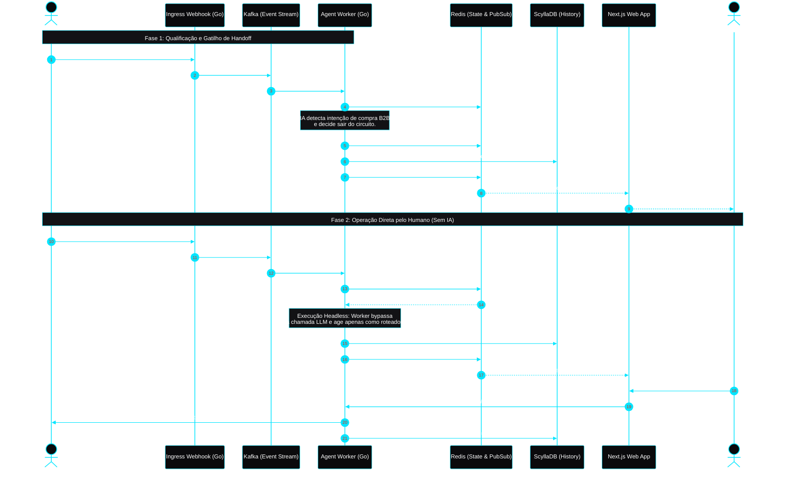

# Transição Assíncrona: O Handoff Perfeito para Vendas

Este documento detalha o fluxo de transição invisível entre a inteligência artificial e o operador humano. Em operações corporativas B2B de alto valor, o atrito deve ser zero. A passagem de bastão ocorre de forma totalmente assíncrona: o sistema altera a máquina de estados no cache distribuído e atualiza a interface de operação em tempo real, sem que o cliente final perceba qualquer mudança sistêmica.

## Diagrama de Sequência e Roteamento

